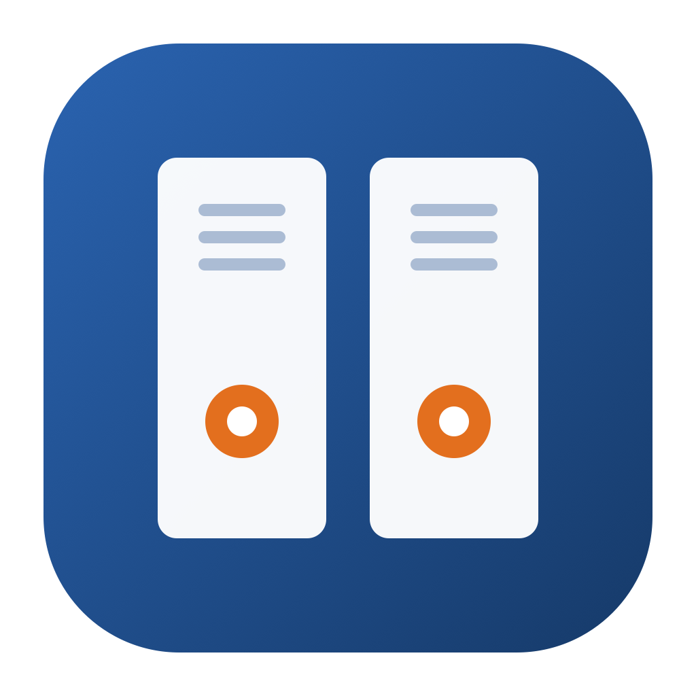
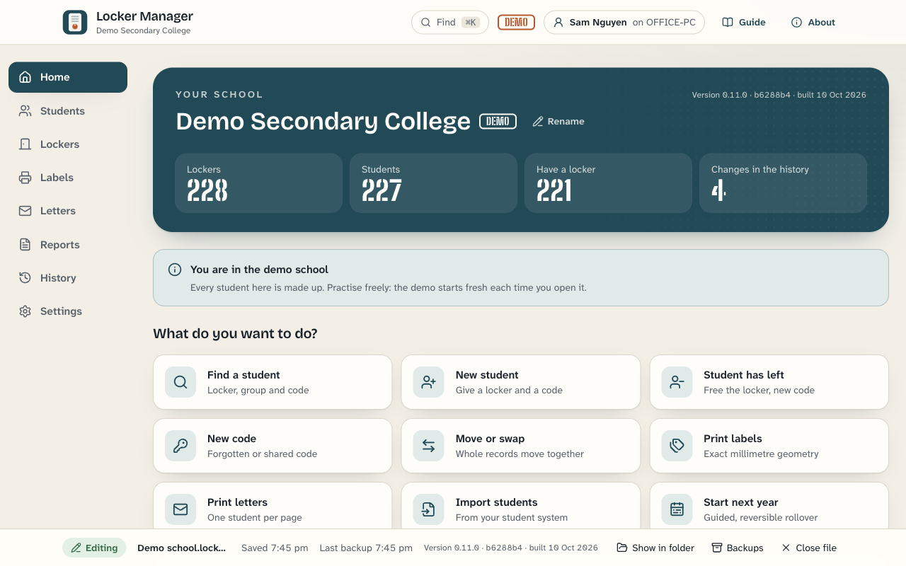
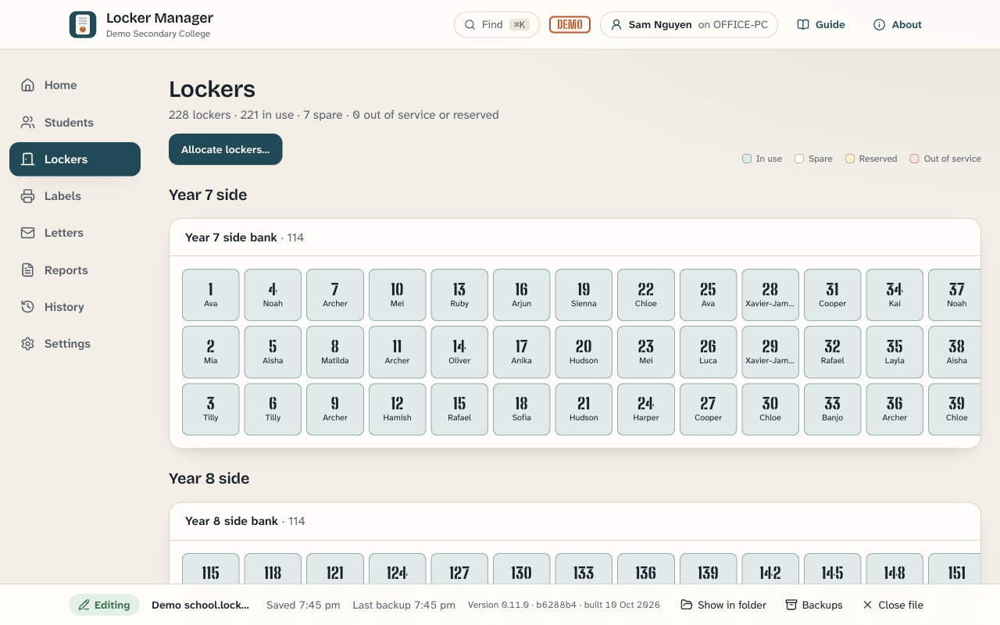
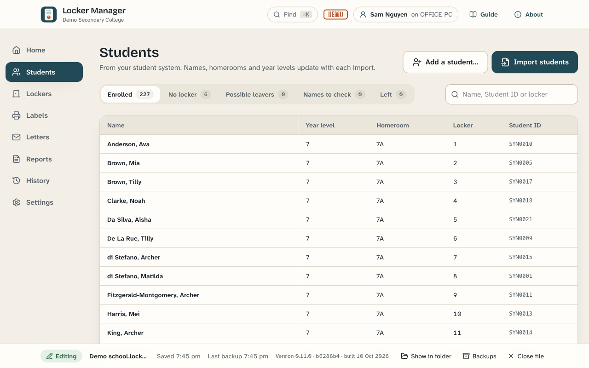
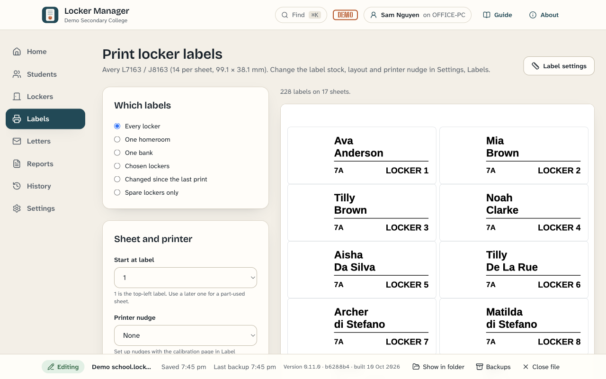
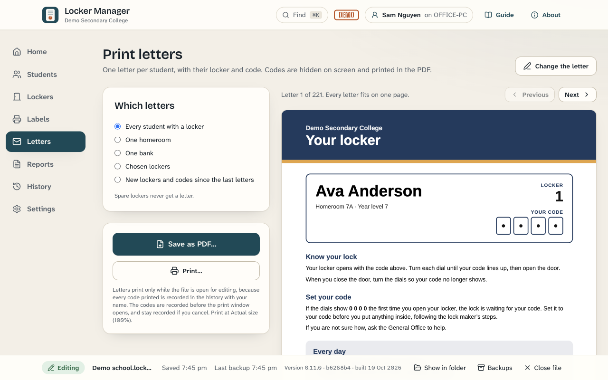

  

<h1 align="center">Locker Manager</h1>

  <strong>Every locker, every code, every student.</strong> 
  A free desktop app for school offices: give out lockers, issue lock codes, print labels and
  welcome letters, and keep it right all year. Windows and Mac. Your data stays in your school.

  

  
  
  

  <a href="https://mrdavearms.github.io/locker-manager/download/"><strong>Download and install help</strong></a> ·
  <a href="https://mrdavearms.github.io/locker-manager/">Website</a> ·
  <a href="docs/user-guide.md">User guide</a> ·
  <a href="docs/it-guide.md">For school IT</a> ·
  <a href="#your-data-for-privacy-assessments">Privacy</a>

  <picture>
    <source media="(prefers-color-scheme: dark)" srcset="site/images/home-dark.png" />
    
  </picture>

> [!NOTE]
> **Pre-release (version 0.x), ready to try at a school.** Version 1.0 follows after the hand
> checks in [the release checklist](docs/release-checklist.md): real label sheets on a laser
> printer, letters on paper, a Windows install at a school, and code signing once it is bought.

## Download

**[Go to the download page](https://mrdavearms.github.io/locker-manager/download/)**. It picks
the right file for your computer and walks you through installing it.

> [!IMPORTANT]
> **The first time you open it, your computer shows a security warning.** Locker Manager is not
> yet registered with Microsoft or Apple, so Windows says "Windows protected your PC" and a Mac
> says it cannot check the app. This is expected and happens only once. The
> [download page](https://mrdavearms.github.io/locker-manager/download/) shows exactly what to
> click on each computer. In short:
>
> - **Windows:** click **More info**, then **Run anyway**. No administrator password needed.
> - **Mac:** drag the app into **Applications**, try to open it once and click **Done**, then
>   go to **System Settings**, **Privacy & Security**, and click **Open Anyway**.
>
> On a school-managed computer, ask your IT team first: many schools block new apps.

Once installed, Locker Manager updates itself on Windows and on a Mac (on a Mac, keep it in the
Applications folder). Every version, with its release notes, is on the
[releases page](https://github.com/mrdavearms/locker-manager/releases).

## See it

<table>
  <tr>
    <td width="50%"> <strong>Lockers.</strong> Every bank at a glance, with who has each locker.</td>
    <td width="50%"> <strong>Students.</strong> Imported from your student system, or added by hand.</td>
  </tr>
  <tr>
    <td width="50%"> <strong>Labels.</strong> Exact millimetre positions on Avery sheets.</td>
    <td width="50%"> <strong>Letters.</strong> One page per student, codes hidden on screen.</td>
  </tr>
</table>

All pictures show the demo school that comes with the app. Every student in it is made up.

## What it does

- **Imports students** from your student system's export: Compass, Sentral, SIMON, Xuno,
  Synergetic, TASS, CASES21 or any spreadsheet. Fixes capitals in surnames and asks a person
  to check the tricky ones. Students can also be added by hand.
- **Allocates lockers** by your rules (year level to area, group order, surname, groups
  placed last, accessible lockers first), with a draft you check before anything changes.
  Each area can have its own order.
- **Issues lock codes** that follow the lock makers' advice. By default a lock is never
  given a code it had in the last three years, and no two locks in the school share a code;
  a school can change both rules. Codes are hidden until asked for, and the app records who
  showed, printed or exported each code. An optional PIN guards codes.
- **Prints labels** at exact millimetre positions on Avery sheets, with your own
  measurements, a calibration page and printer nudges.
- **Prints letters**: one page per student, with only the sections that suit their lock,
  in more than one language if you need, with a progress bar and Cancel.
- **Reports and exports**: group lists, a confidential master list, lockers by bank, reset
  checklists, sign-off sheets, a key register and changes since a date, as PDF, Excel or CSV.
- **Through the year**: new students, leavers, moves and swaps (Move or swap on Home), a
  year level or group change with an offer to move the student, new codes, locks to reset
  with tick boxes and Mark as reset, and a full history of who changed what. A message
  confirms each change for 8 seconds with Undo.
- **Start next year**: a guided rollover, with students resetting their own locks on their
  last day.
- **Small schools**: a school that only records who has which locker can do just that. Quick
  start makes an area, a bank and its lockers in one step; keyed locks or no locks mean no
  codes; labels and letters can be marked "We don't use this" so the app stops suggesting
  them.
- **Help built in**: a short tour the first time, a getting-started list on Home, the guide
  inside the app, a demo school with made-up students, and a practice copy for training.

Not built yet, although the [specification](SPEC.md) mentions them: a passphrase that
encrypts codes (an optional PIN is built instead), opt-in crash reports, release notes shown
inside the app (they are on the release page), and screens in languages other than English
(letters can already be in more than one language).

## Your data (for privacy assessments)

Locker Manager has no server and no accounts. Everything it stores is in files on your
school's computers and in the folder your school chooses. In Victoria, the Department of
Education's privacy and records requirements for schools apply to these files, as to any
other student records the school keeps.

### The data file

One file ending in `.lockers` (a SQLite database), in the folder your school chooses, such
as a shared drive, OneDrive or SharePoint. It holds:

- **Students**: student ID, first name, surname and preferred name (both as imported and as
  corrected), year level and group. House, gender and email only if your import includes
  those columns. A tick for "needs an accessible locker" (no medical detail). The language
  for their letter, if one is set. The dates they were first and last seen in an import,
  and the date they left.
- **Lockers, locks and keys**: locker numbers and places, lock serial and key numbers, key
  records (issued, returned, lost, with any charge and note), and notes staff type on
  lockers, locks, banks and locker assignments, and reasons for leaving a student out.
- **Lock codes and spare codes**, encrypted (see below), with each lock's code history.
- **The school's set-up**: name, logo, colours, settings, letter wording and pictures.
- **Records of use**: the names of imported files; every print run of labels or letters
  (who, which computer, which students); every code shown, printed or exported (who, which
  computer, which student and locker, and where it was shown).
- **History**: every change, with the staff member's name, the computer's name, the time,
  and the values before and after. The history cannot be edited or deleted, so earlier
  names and details stay in it.

### Beside the data file

- Backups of the file are kept in a `Locker Manager backups` folder beside it, compressed
  (`.lockers.gz`). They hold everything the data file holds, including codes. Every save
  is kept for a day, then one an hour for a week, then one a day for 99 days, within a
  500 MB limit; Settings, Storage shows how far back they really reach.
- While someone is editing, `<name>.lockers.lock` holds their name, computer name and app
  version. It is removed when they close the file.

### On each computer that uses the app

In the app's folder (Windows `%AppData%\Locker Manager\`, Mac
`~/Library/Application Support/Locker Manager/`):

- `backups`: more compressed backups of the file, kept on each computer that has edited it.
  They hold codes. If the app ever closes without being able to save, the unsaved changes
  are kept as a backup named "unsaved changes at close", here and beside the data file.
- `Practice`: a copy of the school's file, if someone used **Practise on a copy**. A copy
  made on the computer that is editing holds the codes; a copy made on any other computer
  has every code removed. It is replaced the next time practice starts.
- `Demo`: the demo school (made-up students only).
- `preferences.json`: the person's name, recently opened files and their school names,
  appearance and update choices, and whether the tour has been seen.

Logs are in `%AppData%\Locker Manager\logs\` (Windows) and `~/Library/Logs/Locker Manager/`
(Mac). They record actions and errors, never student names or codes, but file paths (and
so the file's name) can appear.

**Uninstalling does not remove these folders.** When a computer leaves the school, delete
the app folder and the logs folder above by hand.

### Files staff save

Labels, letters, reports and exports go where the person saving them chooses (the Documents
folder unless they pick another). Letters, the master list, reset lists with codes, and a
whole-file export with **include codes** ticked contain codes in plain text; reports and
exports with codes are marked CONFIDENTIAL. Once saved, these files are outside the app's
control: store and delete them like confidential paper records.

### Lock codes

Codes are hidden on screen until someone asks to see one, and hide again after 30 seconds
(a school can choose 10 seconds to 2 minutes). In the file, codes are encrypted with
AES-256-GCM, but the key is kept in the same file. This stops someone casually reading codes
with a database tool; it does not stop a skilled person who has a copy of the file. Protect
the file, and its backups, by limiting who can open the folder.

An optional PIN stops anyone showing, printing or exporting codes in the app without it. The
PIN is stored only as a salted scrypt hash (a one-way scrambled form), never the PIN itself.
The PIN guards the app's screens; it does not encrypt the file.

### What leaves the computer

No student data, ever. There is no telemetry, no analytics and no crash reporting. The only
network traffic is the update check, a few seconds after the app starts and every four hours:
the app asks GitHub (`github.com`) whether a newer version exists and downloads it from
`release-assets.githubusercontent.com`. The requests carry nothing about the school, its
staff or its students; like any web request, GitHub sees the computer's internet address.
IT can turn automatic checks off (see the IT guide).

### Removing data

The app does not delete students. A student who leaves is marked as left and kept, with their
history, so the record stays complete; the history itself cannot be deleted. To remove
students' data, follow your school's records policy: for example, keep the old file and its
backups for the required time, then delete the data file, the `Locker Manager backups`
folder, and the app folder on each computer that used it.

## For school IT

See the [IT guide](docs/it-guide.md): installing per user or per machine, managed settings
(`managed.json`), network needs for updates, backup locations and the security model.

## Help

The [user guide](docs/user-guide.md) is also inside the app: click **Guide**.

## Licence

MIT. See [LICENSE](LICENSE). The full specification is in [SPEC.md](SPEC.md).

Locker Manager is built with other open-source software: Electron and Chromium, about 190
npm packages, and four font families under the SIL Open Font Licence (Arimo on labels and
letters; Atkinson Hyperlegible Next, Bricolage Grotesque and Big Shoulders Stencil on
screen). Their licences ship with the app: click **About**, then **Third-party software**.
The list is made at build time by `scripts/third-party-notices.mjs`.
